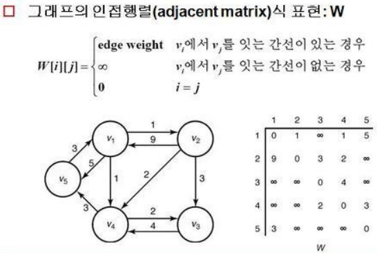
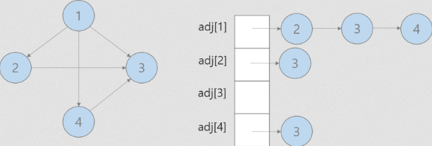
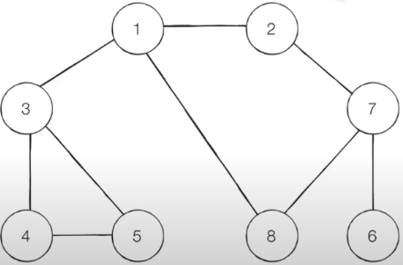

# DFS/BFS

## 기본 숙지 사항
아래는 DF/BF 탐색을 위해 기초가되는 내용이므로 숙지해야한다.

### Graph - 인접 행렬 방식 구현
노드와 노드 사이의 간선 가중치를 값으로 가지는 행렬로 구성된 그래프.


> 예제는 방향이 고려됐지만, 무지향성인 경우 대칭행렬이 된다.     
> 가중치가 고려되지 않는경우, 연결됨: 1, 끊김: 0 으로 표현하면 된다.     
> 인접 리스트 방식에 비해 메모리를 더 먹는 대신 전체탐색 속도가 빠르다.

```python
I = 123456789

graph = [
    [0, 1, I, 1, 5],
    [9, 0, 3, 2, I],
    [I, I, 0, 4, I],
    [I, I, 2, 0, 3],
    [3, I, I, I, 0]
]
```

### Graph - 인접 리스트 방식 구현
노드와 연결 된 (노드, 가중치)를 튜플로 가지는 리스트 방식의 그래프.


> 인접 행렬 방식에 비해 메모리를 덜 먹는 대신 전체탐색 속도가 느리다.

```python
# 편의상 0번 index는 사용하지 않음
graph = [[] for _ in range(4 + 1)]

# 각 노드에 연결된 정보 (노드, 가중치)
graph[1].append((2, 1))
graph[1].append((3, 1))
graph[1].append((4, 1))

graph[2].append((3, 1))

graph[4].append((3, 1))
```

### 탐색 - 문법
파이썬에서 스택은 별도의 import 없이 사용가능하다.
```python
stack = []

stack.append(5)
stack.pop()
```  

파이썬에서 큐는 deque 라이브러리를 사용한다.
```python
from collections import deque

queue = deque()

queue.append(5)
queue.append(6)
queue.popleft()
queue.reverse()
```

## DFS
Depth-First Search 로 stack을 이용한 깊이 우선탐색이다.     
다음 간선으로 넘어가기 전에 해당 간선을 완전탐색한다.  
아래의 그래프를 DFS로 순회하는 코드는 다음과 같다.


```python
def dfs(graph, node, visited):
    visited[node] = True
    print(node, end=' ')

    # node의 각 간선을 우선으로 완전 탐색
    for i in graph[node]:
        if not visited[i]:
            dfs(graph, i, visited)

if __name__ == '__main__':
    graph = [
        [],
        [2, 3, 8],
        [1, 7],
        [1, 4, 5],
        [3, 5],
        [3, 4],
        [7],
        [2, 6, 8],
        [1, 7]
    ]

    visited = [False] * 9

    dfs(graph, 1, visited)
```

## BFS
Breadth-First Search 로 Queue를 이용한 너비 우선 탐색이다.       
해당 노드에 인접한 노드를 우선 탐색한다.     
탐색이 root에서 퍼져나가는 느낌의 너비 우선 탐색이다.        
아래의 그래프를 BFS로 순회하는 코드는 다음과 같다.


```python
from collections import deque

def bfs(graph, node, visited):
    # queue에 현재 노드를 추가
    queue = deque([node])
    visited[node] = True

    while queue:
        v = queue.popleft()
        print(v, end=' ')

        for i in graph[v]:
            if not visited[i]:
                queue.append(i)
                visited[i] = True

if __name__ == '__main__':
    graph = [
        [],
        [2, 3, 8],
        [1, 7],
        [1, 4, 5],
        [3, 5],
        [3, 4],
        [7],
        [2, 6, 8],
        [1, 7]
    ]

    visited = [False] * 9

    bfs(graph, 1, visited)
```

## 정리
DFS     
* 동작원리: 스택 
* 구현방법: 재귀함수

BFS
* 동작원리: 큐
* 구현방법: 큐

일반적으로 2차원 배열의 단순 탐색시 유용하다.